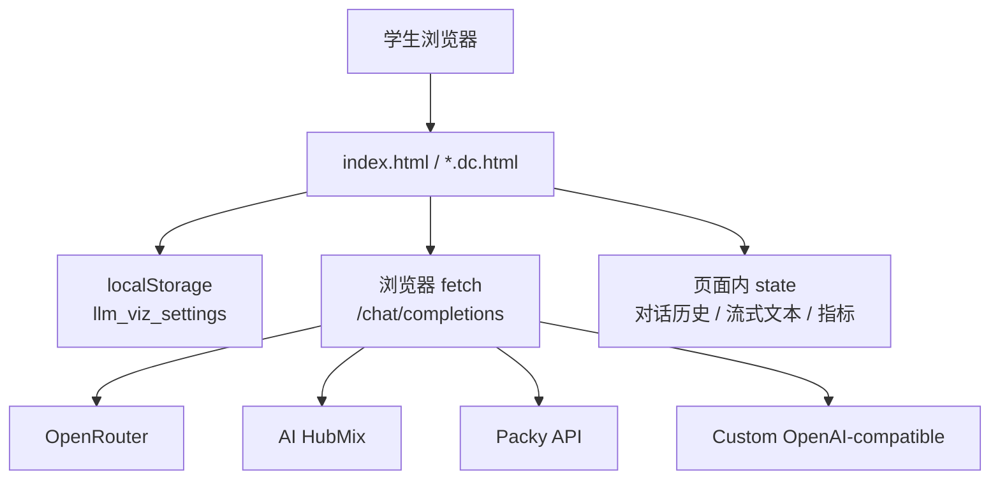
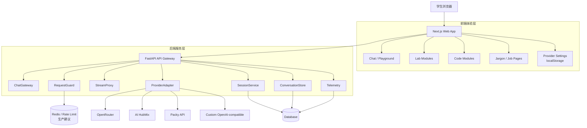
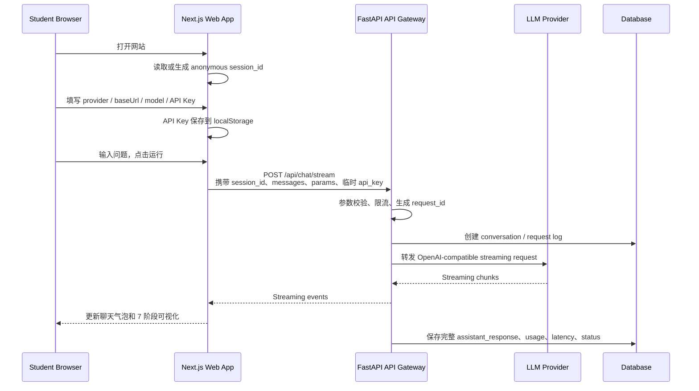
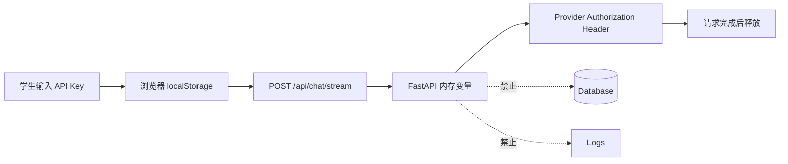
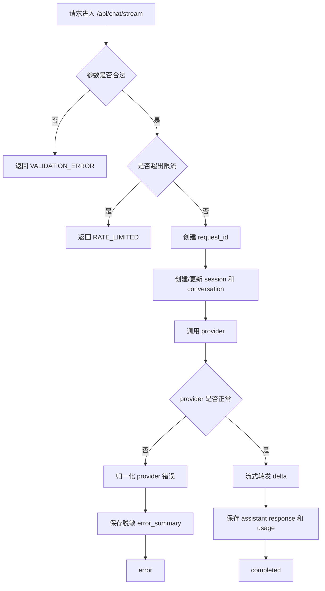
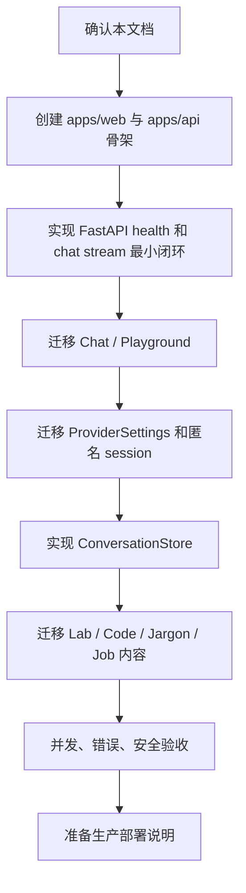

# AI 教学工具生产化重构架构文档

更新日期：2026-06-30

本文档只定义架构与工程契约，不代表已经开始实现。当前仓库仍以静态 HTML/DC Demo 为主，后续开发应先以本文档作为共同基准，再逐步落地 Next.js + FastAPI 版本。

---

## 1. 背景与当前问题

### 1.1 自然语言说明

当前项目是一个很适合课堂演示的静态 Demo：页面可以直接打开，学生配置 API Key 后，浏览器直接向 OpenRouter、AI HubMix、Packy API 或自定义 OpenAI-compatible 服务发请求。

这个形态的优点是轻：没有后端、没有数据库、没有构建链路，适合快速验证教学内容。但如果未来通过公网 IP 或域名给多个学生同时访问，它会暴露几个生产化问题：

| 问题 | 当前表现 | 公网多人访问后的风险 |
|---|---|---|
| 职责混杂 | 页面同时负责 UI、课程内容、API 请求、流式解析、错误处理 | 后期难维护，任何一处 API 兼容问题都要改前端 |
| 请求不可治理 | 浏览器直接请求 provider | 不能统一限流、超时、取消、错误归一 |
| 并发不可观测 | 每个学生浏览器各自运行 | 不知道多少学生在用、失败率多高、哪个 provider 出错 |
| 对话无后端记录 | 历史只在页面 state 中 | 无法做教学复盘、排错、学习过程分析 |
| 内容硬编码 | Lab/Code/Jargon/Job 内容混在页面逻辑里 | 后续难做内容版本管理、教师后台、导入导出 |
| API Key 边界弱 | Key 存在浏览器并由浏览器直连 provider | 短期可接受，但无法纳入统一审计和请求保护 |

因此，生产化重构的核心不是“把 HTML 换成新框架”这么简单，而是把系统职责拆开：

- 前端负责教学体验。
- 后端负责请求治理。
- 数据层负责会话、对话、日志和后续统计。

### 1.2 当前架构图



### 1.3 当前关键事实

| 当前文件 | 当前职责 |
|---|---|
| `index.html` | Chat / Playground 主入口，包含真实 LLM 调用、SSE 解析、参数面板、7 阶段可视化 |
| `Lab.dc.html` | 实验室：训练对比、函数调用、白盒分词、推理流程、RAG 演示 |
| `Code.dc.html` | Claude Code 教学模块 |
| `Jargon.dc.html` | AI 黑话词典 |
| `Job.dc.html` | 求职题库页面 |
| `Job.data.js` | 面试题数据 |
| `Nav.dc.html` | 导航与 API provider 设置 |
| `support.js` | 生成的 DC runtime，不应手动修改 |

---

## 2. 目标架构总览

### 2.1 自然语言说明

目标架构采用三层：

1. **前端 Web App**  
   用 Next.js + React 承载学生看到的所有页面：Chat、Lab、Code、Jargon、Job。前端负责交互体验、教学可视化、参数编辑、本地 API Key 设置。

2. **后端 API Gateway**  
   用 FastAPI + Python 承载模型请求代理、流式转发、匿名 session、限流、错误归一、完整对话保存。后端临时使用学生传来的 API Key 调用 provider，但不保存 API Key。

3. **数据与运维层**  
   保存匿名 session、完整对话、请求日志、token usage、错误摘要和过期时间。第一阶段不做教师后台，但数据结构要为后续后台预留。

### 2.2 目标架构图



### 2.3 目标目录结构

```text
apps/
  web/
    # Next.js + React + TypeScript 前端
  api/
    # FastAPI + Python 后端

packages/
  content/
    # Lab / Code / Jargon / Job 教学内容与题库
  shared/
    # API schema、provider config、共享类型

docs/
  architecture/
    production-refactor-plan.md
```

第一阶段可以先在现有 repo 内创建以上结构。当前 HTML/DC 文件暂时保留，作为视觉、文案、交互和内容迁移参考。

---

## 3. 学生访问与交互流程

### 3.1 自然语言说明

学生访问公网网站时，第一阶段不要求注册账号。浏览器第一次打开网站时生成一个匿名 `session_id`，用它区分不同学生和不同浏览器。

学生仍然使用自己的 API Key。Key 保存在学生浏览器 localStorage 中；每次发起聊天时，前端把 Key 临时传给后端，后端只用它请求 provider，不保存、不打印、不写数据库。

这样做的好处是：

- 学生体验比“每次手动粘贴 Key”好。
- 平台不承担学生模型费用。
- 后端仍然可以统一处理限流、断流、错误提示、请求日志和完整对话保存。

### 3.2 学生一次提问的流程



### 3.3 页面交互状态

| 状态 | 前端行为 | 后端行为 |
|---|---|---|
| 首次访问 | 生成 `session_id`，初始化本地设置 | 无 |
| 保存设置 | provider/baseUrl/model/apiKey 写入 localStorage | 无 |
| 发起提问 | 调用 `/api/chat/stream`，进入 pipeline phase | 校验、限流、创建 request log |
| 流式输出 | 逐 chunk 更新 UI 和 metrics | 转发 provider chunk |
| 正常完成 | 收口 metrics，追加 assistant message | 保存完整对话和 usage |
| 中途取消 | 前端 abort request | 后端取消或释放上游连接 |
| provider 报错 | 展示友好错误 | 保存脱敏错误摘要 |

---

## 4. 技术选型说明

### 4.1 横向对比

| 方案 | 前端 | 后端 | 优势 | 缺点 | 适合度 |
|---|---|---|---|---|---|
| Next.js + FastAPI | Next.js / React / TypeScript | FastAPI / Python | 前端现代化，AI 后端专业化；适合 RAG、数据处理、并发治理 | 两套工程，两套部署 | 最高 |
| Next.js 全栈 | Next.js / React / TypeScript | Next.js Route Handlers | 一个语言栈，部署快；适合轻量 AI App | 复杂 RAG、任务队列和 Python AI 生态较弱 | 中高 |
| React/Vite + FastAPI | React / TypeScript SPA | FastAPI / Python | 简单轻量，前后端边界清晰 | 少了 Next.js 的路由、SSR、内容发布能力 | 中高 |
| Django 全栈 | Django Templates 或嵌 React | Django / Python | 用户、权限、后台管理、数据库模型强 | 强交互 AI UI 和流式体验要额外封装 | 中 |
| 静态前端 + API 网关 | 当前 HTML/DC | FastAPI 或 Express | 改动小，能快速止血 | 旧页面技术债仍在，长期维护差 | 短期过渡 |

### 4.2 推荐方案

推荐采用 **Next.js + React + FastAPI + Python**。

| 系统部分 | 推荐技术 | 原因 |
|---|---|---|
| 前端 App | Next.js + React + TypeScript | 适合组件化复杂教学界面、路由、状态管理和后续页面扩展 |
| 后端 API | FastAPI + Python | 适合异步 API、streaming、AI/RAG 生态和 OpenAPI 契约 |
| LLM 调用 | 后端 ProviderAdapter | 隔离 provider 差异，前端不直接感知各 provider 错误格式 |
| 数据库 | 开发 SQLite，生产 Postgres | SQLite 便于本地启动，Postgres 更适合生产并发和长期数据 |
| 限流缓存 | 开发内存限流，生产 Redis | 内存限流简单，Redis 支持多实例部署 |
| 部署 | 前端静态/Node 托管，后端 Docker | 前后端可独立部署、独立扩容 |

### 4.3 选型依据

- Next.js Route Handlers 基于 Web Request/Response API，适合 Web App 中的服务端接口；但本项目的核心 AI 网关、数据保存和未来 RAG 更适合独立 FastAPI 服务。
- FastAPI 官方支持 streaming response 和 WebSocket 场景；本项目第一阶段优先用 HTTP streaming/SSE，后续如需要课堂实时协作再考虑 WebSocket。
- Vercel AI SDK 的 `streamText` 适合 Next.js 全栈路线；在本方案中可作为前端/全栈备选参考，不作为第一阶段主后端。

参考资料：

- Next.js Route Handlers: https://nextjs.org/docs/app/getting-started/route-handlers
- FastAPI StreamingResponse: https://fastapi.tiangolo.com/advanced/custom-response/
- FastAPI Stream Data: https://fastapi.tiangolo.com/advanced/stream-data/
- FastAPI WebSockets: https://fastapi.tiangolo.com/advanced/websockets/
- Vercel AI SDK streamText: https://ai-sdk.dev/docs/reference/ai-sdk-core/stream-text

---

## 5. 前端模块设计

### 5.1 自然语言说明

前端重构的核心目标是把“一个页面里塞所有逻辑”拆成稳定模块。学生看到的体验可以尽量延续当前 Demo：暗色风格、左侧导航、Chat 三栏结构、7 阶段可视化、Lab/Code/Jargon/Job 教学模块。

但工程上，每个模块必须有明确边界：

- 设置模块只管 localStorage 和 provider 配置。
- Chat 模块只管输入、历史和流式渲染。
- Pipeline 模块只管流程状态展示，不直接发请求。
- 内容模块只管展示 structured content，不把数据写死在组件逻辑里。

### 5.2 前端模块表

| Module | 工程职责 | 输入 | 输出 |
|---|---|---|---|
| `AppShell` | 全局布局、导航、主题、页面容器 | 当前 route、用户 session state | 统一页面框架 |
| `SessionBootstrap` | 生成/读取匿名 `session_id` | localStorage/cookie | `session_id` |
| `ProviderSettings` | provider/baseUrl/model/API Key 的本地设置 | 用户表单输入 | `ProviderConfig` 写入 localStorage |
| `ChatPanel` | 对话输入、历史、流式回复渲染 | `ConversationState`、用户输入、stream events | message list、UI state |
| `PipelineVisualizer` | 7 阶段流程状态展示 | `PipelineState`、metrics、messages | 可视化流程 UI |
| `ModelParamsPanel` | LLM 参数编辑 | 用户 slider/input | `ModelParams` |
| `MetricsPanel` | TTFT/TPS/token/cost 展示 | `ChatMetrics` | 指标 UI |
| `LabModules` | 实验室交互模块 | content data、局部 state | Lab 页面 |
| `CodeModules` | Claude Code 教学模块 | content data、局部 state | Code 页面 |
| `ContentPages` | Jargon、Job 内容展示、搜索、筛选 | content data、filter state | 内容页面 |
| `ApiClient` | 与 FastAPI 通信 | typed request | stream reader / typed response |

### 5.3 前端类型草案

```ts
type ProviderId = "openrouter" | "aihubmix" | "packy" | "custom";

interface ProviderConfig {
  provider: ProviderId;
  label: string;
  baseUrl: string;
  model: string;
  apiKey: string; // only stored in browser localStorage
}

interface ModelParams {
  temperature: number;
  topP: number;
  maxTokens: number;
  frequencyPenalty: number;
  presencePenalty: number;
  reasoningEnabled?: boolean;
}

interface ChatMessage {
  role: "system" | "user" | "assistant";
  content: string;
  createdAt?: string;
  tokenEstimate?: number;
}

interface ChatMetrics {
  requestId?: string;
  ttftMs?: number;
  tps?: number;
  inputTokens?: number;
  outputTokens?: number;
  totalTokens?: number;
  costUsd?: number;
}

interface PipelineState {
  phase: 0 | 1 | 2 | 3 | 4 | 5 | 6 | 7;
  status: "idle" | "running" | "completed" | "error" | "cancelled";
  activeRequestId?: string;
}
```

### 5.4 前端本地存储

| Key | 内容 | 是否含敏感信息 | 说明 |
|---|---|---|---|
| `llm_viz_settings` | provider configs，包括 API Key | 是 | 沿用当前设置概念，仅浏览器保存 |
| `llm_viz_session_id` | 匿名 session id | 否 | 用于后端会话归属 |
| `llm_viz_ui_state` | 可选 UI 偏好 | 否 | 如最近页面、折叠状态 |

API Key 不进入 URL，不写入服务端日志，不持久化到数据库。

---

## 6. 后端模块设计

### 6.1 自然语言说明

FastAPI 后端不是为了“替学生付费调用模型”，而是为了把所有不适合散落在浏览器里的生产能力集中起来：

- 统一接收 Chat 请求。
- 校验请求是否合法。
- 做并发和速率限制。
- 将请求转成 provider 需要的 OpenAI-compatible 格式。
- 稳定转发流式响应。
- 保存完整对话和请求指标。
- 对 provider 错误做友好提示。
- 不保存学生 API Key。

### 6.2 后端模块表

| Module | 工程职责 | 关键输入 | 关键输出 |
|---|---|---|---|
| `ChatGateway` | `/api/chat/stream` 主入口，协调完整请求生命周期 | `ChatStreamRequest` | streaming events |
| `ProviderAdapter` | 统一 OpenAI-compatible provider 请求格式 | provider config、messages、params | provider HTTP request |
| `StreamProxy` | 读取上游 SSE/stream 并转成前端事件 | upstream response | `ChatStreamEvent` |
| `RequestGuard` | 参数校验、限流、超时、取消、最大 token 限制 | request metadata | allow / reject |
| `SessionService` | 匿名 session 创建、校验、更新 `last_seen_at` | `session_id`、request metadata | session record |
| `ConversationStore` | 保存完整对话、消息、过期时间 | messages、assistant response | DB records |
| `Telemetry` | 记录 request_id、latency、status、usage、error summary | request lifecycle events | logs / DB rows |
| `ContentAPI` | 后续课程内容接口预留 | content module id | content payload |

### 6.3 ProviderAdapter 接口草案

```python
class ProviderAdapter(Protocol):
    provider_id: str

    def build_chat_url(self, base_url: str) -> str:
        """Return normalized chat completions URL."""

    def build_headers(self, api_key: str) -> dict[str, str]:
        """Return provider headers. Must not log api_key."""

    def build_body(
        self,
        model: str,
        messages: list[dict],
        params: dict,
        stream: bool,
    ) -> dict:
        """Return provider-compatible JSON body."""

    async def normalize_error(self, response_status: int, response_text: str) -> dict:
        """Return sanitized application error."""
```

### 6.4 StreamProxy 事件类型

后端向前端输出统一事件，不把 provider 原始事件格式暴露给前端。

```ts
type ChatStreamEvent =
  | { type: "request_started"; request_id: string; conversation_id: string }
  | { type: "phase"; phase: number; label: string }
  | { type: "delta"; content: string }
  | { type: "usage"; input_tokens?: number; output_tokens?: number; total_tokens?: number }
  | { type: "metrics"; ttft_ms?: number; latency_ms?: number; tps?: number }
  | { type: "completed"; assistant_message_id: string }
  | { type: "error"; error: ApiError }
  | { type: "cancelled"; request_id: string };
```

### 6.5 RequestGuard 默认策略

| 策略 | 第一阶段默认值 | 说明 |
|---|---|---|
| 单请求超时 | 120s | 防止上游卡死 |
| 最大输入消息数 | 50 | 防止浏览器误传超长 history |
| 最大 `max_tokens` | 4096 | 与当前 Demo 保持一致 |
| IP 限流 | 开发可关闭，生产必须开启 | 第一阶段可内存实现 |
| Session 限流 | 例如 10 req/min | 防止同一浏览器误刷 |
| API Key 保存 | 禁止 | 只允许请求生命周期内使用 |
| 完整对话保存 | 允许 | 默认 30 天过期 |

---

## 7. API 接口草案

### 7.1 接口总表

| Method | Path | 用途 | 第一阶段是否实现 |
|---|---|---|---|
| `GET` | `/health` | 服务健康检查 | 是 |
| `POST` | `/api/chat/stream` | Chat 流式主接口 | 是 |
| `GET` | `/api/sessions/{session_id}/conversations` | 查询匿名 session 的对话列表 | 是 |
| `DELETE` | `/api/sessions/{session_id}/conversations/{conversation_id}` | 删除某条对话 | 是 |
| `GET` | `/api/content/modules` | 课程内容模块列表 | 可预留，五页迁移时实现 |

### 7.2 `GET /health`

Response:

```json
{
  "status": "ok",
  "service": "teaching-tool-api",
  "version": "0.1.0"
}
```

### 7.3 `POST /api/chat/stream`

用途：接收前端聊天请求，临时使用学生 API Key 调用 provider，并以统一事件格式流式返回。

Request body:

```json
{
  "session_id": "anon_01hxx...",
  "conversation_id": "conv_01hxx...",
  "provider": "openrouter",
  "base_url": "https://openrouter.ai/api/v1",
  "model": "openai/gpt-4o",
  "api_key": "temporary-client-provided-key",
  "messages": [
    { "role": "system", "content": "你是一个专业的 AI 技术助手，请用简洁清晰的中文回答问题。" },
    { "role": "user", "content": "用一句话解释什么是 Transformer" }
  ],
  "params": {
    "temperature": 1,
    "top_p": 1,
    "max_tokens": 1024,
    "frequency_penalty": 0,
    "presence_penalty": 0,
    "reasoning_enabled": false
  },
  "stream": true
}
```

Request validation:

| Field | Rule |
|---|---|
| `session_id` | 必填，匿名 session id；不存在时可创建 |
| `conversation_id` | 可选；为空时后端创建新 conversation |
| `provider` | 必须是 `openrouter`、`aihubmix`、`packy`、`custom` |
| `base_url` | 必填，必须是 http/https URL |
| `model` | 必填，非空字符串 |
| `api_key` | 必填，非空字符串；只用于本次请求 |
| `messages` | 必填，至少包含 1 条 user message |
| `params.max_tokens` | 1 到 4096，默认 1024 |
| `stream` | 第一阶段固定为 `true` |

Streaming response event examples:

```text
event: request_started
data: {"type":"request_started","request_id":"req_01hxx","conversation_id":"conv_01hxx"}

event: delta
data: {"type":"delta","content":"Transformer"}

event: usage
data: {"type":"usage","input_tokens":42,"output_tokens":18,"total_tokens":60}

event: completed
data: {"type":"completed","assistant_message_id":"msg_01hxx"}
```

Error event:

```text
event: error
data: {"type":"error","error":{"code":"PROVIDER_AUTH_FAILED","message":"Provider authentication failed. Please check your API Key.","request_id":"req_01hxx","retryable":false}}
```

### 7.4 `GET /api/sessions/{session_id}/conversations`

用途：让当前匿名浏览器查看自己保存过的对话。第一阶段不做教师后台，因此只能按自己的 `session_id` 查询。

Response:

```json
{
  "session_id": "anon_01hxx...",
  "conversations": [
    {
      "conversation_id": "conv_01hxx...",
      "title": "Transformer 解释",
      "created_at": "2026-06-30T10:00:00Z",
      "updated_at": "2026-06-30T10:02:00Z",
      "expires_at": "2026-07-30T10:00:00Z",
      "message_count": 4
    }
  ]
}
```

### 7.5 `DELETE /api/sessions/{session_id}/conversations/{conversation_id}`

用途：允许学生删除自己浏览器 session 下的某条对话。

Response:

```json
{
  "deleted": true,
  "conversation_id": "conv_01hxx..."
}
```

### 7.6 `GET /api/content/modules`

用途：为迁移后的前端提供教学内容索引。第一阶段可以从 `packages/content` 读取静态内容，也可以由 Next.js 直接 import content modules；该接口作为后续教师后台和内容远程化预留。

Response:

```json
{
  "modules": [
    { "id": "chat", "title": "Chat / Playground", "route": "/" },
    { "id": "lab", "title": "实验室", "route": "/lab" },
    { "id": "code", "title": "Claude Code", "route": "/code" },
    { "id": "jargon", "title": "黑话词典", "route": "/jargon" },
    { "id": "job", "title": "求职", "route": "/job" }
  ]
}
```

---

## 8. 数据模型草案

### 8.1 自然语言说明

第一阶段保存完整对话，是为了后续教学复盘和排错。但因为没有账号登录，也没有教师后台，数据边界必须简单、清楚：

- 每个浏览器对应一个匿名 session。
- 每条对话挂在匿名 session 下。
- 对话默认 30 天过期。
- API Key 永远不入库。
- 日志只保存脱敏错误摘要。

### 8.2 概念模型

| Model | Fields | 说明 |
|---|---|---|
| `AnonymousSession` | `session_id`, `created_at`, `last_seen_at`, `user_agent_hash`, `ip_hash` | 匿名学生会话，不保存真实身份 |
| `Conversation` | `conversation_id`, `session_id`, `title`, `created_at`, `updated_at`, `expires_at`, `deleted_at` | 一次或多轮聊天 |
| `Message` | `message_id`, `conversation_id`, `role`, `content`, `created_at`, `token_estimate`, `provider_message_id` | 完整消息内容 |
| `ChatRequestLog` | `request_id`, `conversation_id`, `provider`, `model`, `status`, `latency_ms`, `ttft_ms`, `usage_json`, `error_code`, `error_summary`, `created_at` | 请求级日志 |
| `ContentModule` | `module_id`, `title`, `version`, `content_hash`, `updated_at` | 后续内容版本管理预留 |

### 8.3 字段约束

| Field | Constraint |
|---|---|
| `session_id` | 以 `anon_` 开头，全局唯一 |
| `conversation_id` | 以 `conv_` 开头，全局唯一 |
| `message_id` | 以 `msg_` 开头，全局唯一 |
| `request_id` | 以 `req_` 开头，全局唯一 |
| `expires_at` | 默认 `created_at + 30 days` |
| `role` | `system`、`user`、`assistant`、`tool` 中之一；第一阶段主要使用前三个 |
| `content` | 保存完整内容；后续如引入敏感词策略，可在写入前做提示或脱敏 |

### 8.4 禁止保存字段

以下内容不得写入数据库、日志、错误响应或 telemetry：

| 禁止项 | 原因 |
|---|---|
| `api_key` | 学生私密凭据 |
| `Authorization` header | 等同于 API Key |
| 完整 provider request headers | 可能包含认证信息 |
| 含 Key 的完整错误对象 | provider SDK/HTTP client 可能带敏感上下文 |
| 原始 IP | 第一阶段只保存 `ip_hash` |

---

## 9. API Key 与隐私安全边界

### 9.1 Key 生命周期



### 9.2 隐私提示建议

前端设置页需要明确提示：

```text
API Key 只保存在当前浏览器。发送消息时，Key 会临时传给本教学工具后端用于转发模型请求；后端不会保存 Key。对话内容会被保存用于学习记录和问题排查，默认 30 天后过期。
```

### 9.3 对话保存边界

| 决策 | 第一阶段默认 |
|---|---|
| 是否保存完整对话 | 是 |
| 保存多久 | 30 天 |
| 是否保存 API Key | 否 |
| 是否做账号登录 | 否 |
| 是否做教师后台 | 否 |
| 学生是否可删除自己的对话 | 是，按匿名 session 删除 |

---

## 10. 并发、限流与错误处理

### 10.1 并发治理流程



### 10.2 错误码草案

| Code | HTTP / Event | 说明 | Retryable |
|---|---|---|---|
| `VALIDATION_ERROR` | 400 / error event | 请求字段缺失或不合法 | false |
| `MISSING_API_KEY` | 400 / error event | 未提供 API Key | false |
| `UNSUPPORTED_PROVIDER` | 400 / error event | provider 不在允许列表 | false |
| `RATE_LIMITED` | 429 / error event | 超出 IP 或 session 限流 | true |
| `PROVIDER_AUTH_FAILED` | 401 / error event | provider 认证失败 | false |
| `PROVIDER_RATE_LIMITED` | 429 / error event | provider 返回限流 | true |
| `PROVIDER_ERROR` | 502 / error event | provider 5xx 或未知错误 | true |
| `STREAM_INTERRUPTED` | 502 / error event | 上游流中断 | true |
| `REQUEST_TIMEOUT` | 504 / error event | 请求超时 | true |
| `REQUEST_CANCELLED` | 499 / cancelled event | 用户取消 | false |

### 10.3 Error response schema

```ts
interface ApiError {
  code: string;
  message: string;
  request_id?: string;
  retryable: boolean;
  provider?: string;
  status?: number;
}
```

示例：

```json
{
  "error": {
    "code": "PROVIDER_RATE_LIMITED",
    "message": "The selected provider is rate limited. Please wait and try again.",
    "request_id": "req_01hxx...",
    "retryable": true,
    "provider": "openrouter",
    "status": 429
  }
}
```

---

## 11. 第一阶段迁移范围

### 11.1 范围内

| Area | Scope |
|---|---|
| 前端 | 使用 Next.js + React 迁移 Chat、Lab、Code、Jargon、Job 五页 |
| 后端 | 使用 FastAPI 实现 Chat streaming gateway 和基础 session/conversation API |
| 内容 | 将 Lab/Code/Jargon/Job/Job.data 内容迁移为 typed content modules |
| 数据 | 保存匿名 session、完整对话、request log、usage、30 天过期时间 |
| 安全 | API Key 仅浏览器保存，后端临时转发，不入库 |
| 验收 | 完成五页可访问、Chat 可真实流式请求、错误和并发基本可控 |

### 11.2 范围外

| Out of Scope | 原因 |
|---|---|
| 账号登录 | 第一阶段保持课堂快速访问 |
| 教师后台 / 管理员 UI | 数据结构预留，界面后续再做 |
| 服务器统一托管 API Key | 当前决策为学生自带 Key |
| RAG 真实知识库 | Lab 页面保留教学演示，真实 RAG 后续扩展 |
| 复杂权限系统 | 没有账号体系前不引入 |
| 视觉大改版 | 第一阶段优先架构和功能迁移 |

### 11.3 推荐实施顺序



---

## 12. 测试与验收标准

### 12.1 文档验收

本文档完成后，应满足：

- 非工程读者能理解为什么要从静态 Demo 重构到三层架构。
- 工程实现者能根据文档创建项目骨架。
- 前端模块、后端模块、API contract、数据模型边界清晰。
- 明确第一阶段迁移全部五页。
- 明确学生 API Key 浏览器保存、后端临时转发、不保存。
- 明确完整对话保存 30 天。

### 12.2 前端验收

| Test | Acceptance |
|---|---|
| 页面可访问 | Chat、Lab、Code、Jargon、Job 五页均可打开 |
| 设置持久化 | provider/baseUrl/model/apiKey 刷新后仍在 localStorage |
| 匿名 session | 首次访问生成 `session_id`，刷新不变 |
| Chat 流式输出 | delta 可逐步显示，最终消息落入历史 |
| Pipeline 可视化 | phase 1-7 与请求生命周期对应 |
| 内容迁移 | Lab/Code/Jargon/Job 内容不低于旧版 |

### 12.3 后端验收

| Test | Acceptance |
|---|---|
| Health check | `GET /health` 返回 `status: ok` |
| Chat streaming | `POST /api/chat/stream` 可转发 OpenAI-compatible stream |
| Key 安全 | 数据库和日志中不出现 API Key |
| 对话保存 | 完整 user/assistant message 保存到 conversation |
| 30 天过期 | 新 conversation 自动写入 `expires_at` |
| 错误归一 | 缺 Key、错 Key、429、5xx、断流、超时都有统一错误 |
| 删除对话 | 匿名 session 可删除自己的 conversation |

### 12.4 并发验收

| Scenario | Acceptance |
|---|---|
| 20-50 个并发 chat requests | 不串 session、不串 conversation、不串 API Key |
| 同 session 多轮对话 | message 顺序和 conversation 归属正确 |
| 用户取消请求 | 后端释放上游连接或停止消费 stream |
| provider 断流 | 前端收到 `STREAM_INTERRUPTED` 友好错误 |
| 限流触发 | 返回 `RATE_LIMITED`，不继续调用 provider |

---

## 13. 后续演进方向

### 13.1 教师后台

当第一阶段稳定后，可以增加教师/管理员后台：

- 查看匿名 session 列表。
- 按时间、provider、错误码筛选请求。
- 查看学生对话，用于课堂复盘。
- 导出课程使用数据。

在引入后台前，需要重新讨论权限、身份、隐私提示和数据访问边界。

### 13.2 课堂码

完全公开访问适合早期，但课堂使用时建议增加课堂码：

```text
classroom_code -> anonymous sessions -> conversations
```

这样可以让老师按课堂查看聚合数据，同时不必立刻做正式账号系统。

### 13.3 真实 RAG 与课程知识库

后续可以将课程文档、术语、题库向量化：

- `ContentModule` 作为源内容。
- Embedding 建索引。
- 学生提问时检索课程材料。
- Chat 页面显示引用来源。

这部分适合放在 FastAPI/Python 后端，因为 Python 的 RAG、向量数据库和数据处理生态更成熟。

### 13.4 Provider 配额与服务器托管 Key

如果未来希望学生免配置 API Key，可以增加服务器托管 Key 模式：

- 后端保存平台 provider key。
- 按课堂、session 或用户限额。
- 增加成本统计和滥用防护。

这会明显提高平台责任和成本，不能在没有限流、审计、权限策略的情况下贸然开启。

---

## 14. 决策记录

| 决策 | 当前结论 |
|---|---|
| 前端技术栈 | Next.js + React + TypeScript |
| 后端技术栈 | FastAPI + Python |
| 第一阶段迁移范围 | Chat、Lab、Code、Jargon、Job 五页一起迁移 |
| 学生身份 | 匿名 `session_id` |
| API Key 策略 | 浏览器保存，后端临时转发，不保存 |
| 对话保存 | 保存完整对话 |
| 保存周期 | 默认 30 天 |
| 教师后台 | 第一阶段不做，仅预留数据结构 |
| 旧静态文件 | 暂时保留作为迁移参考 |

