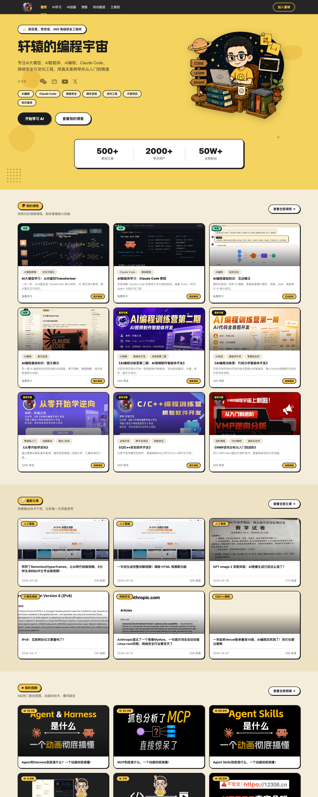

# 03 · UI 设计系统（像素级）

> 全部数值来自源码：CSS `:root` 自定义属性、内联 `style`、Tailwind 类频次统计。风格一句话：**暖调新粗野主义（Warm Neo-Brutalism）**——奶油纸底 + 明黄品牌色 + 2px 粗黑边 + 零模糊硬阴影 + 高权重展示字体。

## 1. 风格基因：Neo-Brutalism 的五个标记

1. **零模糊偏移硬阴影**：`box-shadow: Npx Npx 0 #1C1C1C`（`blur=0`），而非柔和投影。是全站最强的视觉签名（首页出现 49 次）。
2. **粗黑描边**：`border-2`（2px）实心黑边包裹几乎所有卡片、药丸、按钮（全站 333 次）。
3. **实心平涂色块**：无渐变滤镜的大面积纯色（黄 Hero、奶油卡片），色彩关系直白。
4. **高权重展示字体**：标题用 `AlimamaShuHeiTi` `font-weight:900`，块面感强。
5. **暖调而非冷酷**：不同于经典黑白粗野主义，这里用奶油纸 `#F5EDDB` + 明黄 `#FAC94A` 中和，亲和且高辨识度。

## 2. 色板（Colors）

> 页面实际生效的一套 token（`:root` 覆盖后的活跃值）。命名为便于沟通所拟。

| Hex | 命名 | 角色 | Token | Group |
| --- | --- | --- | --- | --- |
| `#1C1C1C` | Ink / 墨黑 | 主文字、所有边框、所有硬阴影、深色顶栏底 —— 全站出现最多（1805×） | `--ink` | neutral |
| `#57544E` | Ink Soft / 暖灰 | 二级文字、副标题、说明文案 | `--ink-soft` | neutral |
| `#8C8676` | Ink Faint / 淡墨 | 三级文字、元数据、日期/阅读数（常配 `--mono`） | `--ink-faint` | neutral |
| `#F5EDDB` | Paper / 奶油纸 | **页面主画布**、区块背景 | `--paper` | neutral |
| `#EDE3C4` | Paper Deep / 深奶油 | 次级区块底、交替分区、卡片内凹层 | `--paper-deep` | neutral |
| `#FFFFFF` | Paper Card / 卡白 | 卡片表面、悬浮数据条 | `--paper-card` | neutral |
| `#D8CEB6` | Line / 纸线 | 细分隔线、次级 hairline（非黑边处） | `--line` | neutral |
| `#FAC94A` | Brand Yellow / 品牌黄 | **主品牌色**：Hero 满铺、区块头药丸、主 CTA、Logo（454×，第二高频） | `--brand` | brand |
| `#F4D35E` | Yellow Alt / 次黄 | 章节标题栏底、次级黄块（常配 `border-bottom:3px solid #1C1C1C`） | — | brand |
| `#E8B53A` / `#F5C030` | Yellow Deep / 深黄 | 黄色按钮压深/hover 态、描边 | — | brand |
| `#C2410C` | Accent / 灼橙 | 主强调色：链接、强调文字、重点标记（暖橙，非红） | `--accent` | accent |
| `#9A3010` | Accent Deep / 深橙 | 强调色压深态 | `--accent-deep` | accent |
| `#E0561F` | Accent Warm / 暖橙 | 强调色亮态、hover | `--accent-warm` | accent |
| `#FBE6C7` | Accent Wash / 橙晕 | 强调色的浅底/高亮背景 | `--accent-wash` | accent |
| `#F97316` | Orange Glow / 橙光 | `🔥火爆` 发光效果专用（配 `box-shadow:0 0 12px rgba(249,115,22,.6)`） | — | accent |
| `#3E6B8F` | Chart Blue / 图表蓝 | 数据可视化/图表用蓝 | `--chart-blue` | data |
| `#C9B8FF` `#86EFAC` `#7DD3FC` `#FDBA74` `#F9A8D4` | Pastel Set / 柔彩组 | 内容**分类标签**的区分色（紫/绿/蓝/橙/粉），低饱和不抢主色 | — | category |
| `#28C445` | Success Green / 成功绿 | `已开源`/`免费` 类正向状态标 | — | status |
| `rgba(255,255,255,.55/.5/.35)` | Ink-on-Dark / 深底白字 | 深色顶栏与深色视频卡上的分级文字 | — | neutral |

**备注：主题里的另一套预设**（未在当前页面生效，可能是备用/换肤主题）：`--paper:#FAF6EE`、`--ink:#1E2B38`（偏蓝墨）、`--ink-soft:#5C6B79`、`--accent:#C0481E`、`--line:#DCD2BF`。两套都是暖纸调，差异在墨色冷暖与强调橙的明度。

## 3. 排版（Typography）

| 用途 | 字体族 | Token | 说明 |
| --- | --- | --- | --- |
| **展示/标题** | `AlimamaShuHeiTi`（阿里妈妈数黑体 Bold，自托管 woff2） | — | `font-weight:900`；Hero 主标题 `font-size:clamp(2.4rem, 5vw, 3.75rem)`。块面厚重，是「粗野」气质来源。仅有 Bold 一个字重文件，`font-display:swap` |
| **正文/UI 中文** | `Noto Sans SC`, -apple-system, PingFang SC, Microsoft YaHei | `--sans` | 通用正文与界面文字，字重 400/500/700 |
| **衬线（文章正文）** | `Noto Serif SC`, Songti SC, Georgia | `--serif` | 长文阅读场景 |
| **等宽/元数据** | `JetBrains Mono`, ui-monospace, SF Mono, Menlo | `--mono` | 阅读数、日期、版本号、统计数字等「数据感」标签（`font-size:12px` + `--ink-faint`）——用等宽制造技术/数据氛围 |

排版层级手法：**字体族切换 + 字重 + 尺寸三管齐下**。展示字体（数黑体 900）负责大标题的视觉锤，Noto Sans 负责可读正文，JetBrains Mono 负责所有「数字化元信息」，形成「重标题 / 稳正文 / 极客数据」的三段调性。

## 4. 阴影（硬阴影升降梯）

全站阴影是**同一套零模糊黑色偏移**的尺度阶梯，用偏移量表达层级/交互态：

| Token 值 | 用途 |
| --- | --- |
| `1.5px 1.5px 0 #1C1C1C` | 最小元素（小标签、密集控件） |
| `2px 2px 0 #1C1C1C` | **默认卡片/药丸/按钮**（最常用，49×） |
| `3px 3px 0 #1C1C1C` | 稍强调（区块头、重点卡） |
| `4px / 5px / 6px / 8px …0 #1C1C1C` | 递进强调（Hero 插画 `drop-shadow`、大按钮 hover 抬升） |
| `0 0 12px rgba(249,115,22,.6)` 等 | 例外：`🔥火爆` 橙色**发光**（唯一柔性阴影，专用于「热门」信号） |

**规律**：偏移越大 = 视觉层级越高 / 越「浮」。hover 常表现为偏移量增大（元素向左上「抬起」），是新粗野主义的标志性交互。

## 5. 边框 · 圆角 · 间距 · 栅格

- **边框**：主力 `border-2`（2px 黑边，333×）；区块分隔用 `border-t-2` / `border-b-2`（顶/底 2px）；章节标题栏用 `border-bottom:3px solid #1C1C1C`。边框色几乎恒为 `--ink`。
- **圆角**：`rounded-full`（9999px 药丸，394×，全站最爱）用于标签/按钮/角标；`rounded-2xl`（16px，113×）用于卡片；另有 `rounded-xl`(12) / `rounded-lg`(8) / `rounded-3xl`(24) 用于不同尺度容器。**双极化**：要么全圆药丸，要么中大圆角卡片，几乎不用小圆角。
- **间距**：Tailwind 间距节奏 `gap-1/2/3/4/5/6/10`（4px 基数：4/8/12/16/20/24/40px），最常用 `gap-1`~`gap-4`。区块级留白用 `gap-10`（40px）。
- **栅格**：容器 `max-w-7xl`（1280px）居中为主；卡片网格 `grid-cols-3`（桌面三列）为主，响应式降到 `grid-cols-2` / `grid-cols-1`；少量 `grid-cols-4`（如功能小卡）。

## 6. 组件规范（Component Specs）

| 组件 | 规格（像素级） |
| --- | --- |
| **顶部导航** | 深色悬浮条 `background:rgba(28,28,28,0.96)` + `backdrop-filter:blur(12px)`；左 Logo（黄色数黑体）+ 中 7 项菜单（白字，激活/hover 转黄 `#FAC94A`）+ 右 `加入星球` 黄药丸（黑边+硬阴影） |
| **卡片** | `background:#FFFFFF`（或奶油）+ `border-2 #1C1C1C` + `rounded-2xl` + `box-shadow:2px 2px 0 #1C1C1C`；结构 = 封面图(`aspect-ratio:16/9`) → 状态角标 → 分类标签行 → 标题(数黑体) → 卖点(暖灰) → 底部元数据/CTA |
| **状态角标** | 卡片左上，`rounded-full` 小药丸：`免费`=绿底、`星球专属`=黄底 `#FAC94A`、`🔥火爆`=带橙光、`原创开发`/`已开源`=对应色标 |
| **分类标签（chip）** | 小号 `rounded-full` 描边药丸，柔彩组（`#C9B8FF/#86EFAC/…`）区分类别，低饱和不抢主色 |
| **主 CTA 按钮** | `background:#FAC94A;box-shadow:2px 2px 0 #1C1C1C`（黄底黑字黑边硬阴影）；次级 CTA 为**描边款**（透明底 + 黑边）；文字按钮统一以 `→` 收尾（`查看全部 →` / `立即体验 →`） |
| **区块头药丸** | 「emoji + 名称」黄色药丸标签（`background:#FAC94A` + 黑边 + 硬阴影），每个内容板块顶部一个，配右侧 `查看全部 →` |
| **数据条** | 悬浮白卡（`background:white;box-shadow:2px 2px 0 #1C1C1C`），大数字用数黑体，标签用小字暖灰；跨越黄→奶油分区交界处 |
| **视频卡** | 深色底（`background:#1C1C1C`），左上大播放量角标（如 `85.6W`），标题白字——与浅色内容卡形成对比，呼应 B 站视频调性 |
| **章节/窗口标题栏** | `background:#F4D35E;border-bottom:3px solid #1C1C1C`（复古窗口 chrome 感） |

## 7. Do（该站的一致性规则，可作参考）

- 用 `#F5EDDB` 奶油纸做画布，`#FFFFFF` 只用于卡片表面——**从不整页纯白**，保持纸质暖感。
- 所有可交互/可容器元素统一 `2px #1C1C1C` 黑边 + 零模糊硬阴影；层级靠**阴影偏移量**表达，不靠模糊/透明度。
- 品牌黄 `#FAC94A` 只承担「品牌与主行动」（Hero、区块头、主 CTA、Logo），不滥用为大面积文字底。
- 分类标签用低饱和柔彩组区分，**主色系统（墨/纸/黄/橙）保持克制**，避免彩虹化。
- 圆角二选一：药丸(9999px) 或 中大卡片圆角(16/24px)，不用 4/6px 小圆角。
- 数字与元信息一律走 `JetBrains Mono`，制造统一的「数据/极客」质感。
- 免费与付费内容**共用同款卡片**，仅靠一个状态角标区分（降低付费心理门槛）。

## 8. Don't（照搬到本项目需规避的点）

- **不要把它当中性设计系统**：暖调新粗野主义辨识度极高，但与本项目 `teaching_tool` 的**深色终端风（`#00ffa0` on 黑）气质相反**——直接混用会破坏本项目既定视觉（详见 04 篇边界）。
- 不要滥用硬阴影到正文/图标——它有效正因为只加在「块面容器」上；全局堆叠会显脏。
- 不要把 `🔥` 橙色发光扩展到普通元素——它是稀缺的「热门」信号，泛滥即失效。
- 展示字体 `AlimamaShuHeiTi` 是**商用授权字体**，若借鉴需自行确认授权，勿直接搬运其 woff2。
- 别只抄「奶油+黄+黑边」表层——若不配套克制的色彩纪律与统一阴影梯度，很容易做成廉价的「便利贴」感。
